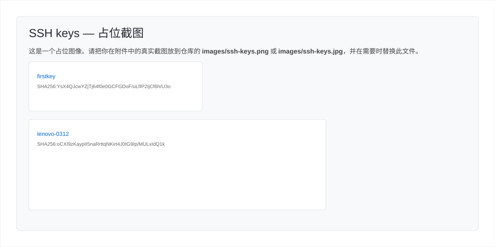

## 第一部分：Git 配置与 GitHub 使用

### **为什么需要版本控制？**

想象一下你正在进行一个复杂的项目，无论是写代码、写论文还是设计作品。你一定会遇到以下问题：

  * **混乱的文件管理**：`项目_v1.zip`, `项目_v2_final.zip`, `项目_final_final_我发誓是最终版.zip`... 这种方式既原始又低效。
  * **无法追溯的错误**：你今天写的代码导致整个项目无法运行，但你不记得昨天做了哪些修改，想恢复到之前的版本变得异常困难。
  * **协作冲突**：你和你的同伴修改了同一个文件，当你们试图合并工作时，一个人的修改覆盖了另一个人的，造成了"代码冲突"的噩梦。

**版本控制系统 (Version Control System, VCS)** 正是为解决这些问题而生的。

**Git** 是当今最流行、最强大的**分布式版本控制系统**。它就像一个精密的时光机和协作中心，能够：

1.  **记录每一次变更**：对文件的每一次增、删、改，Git 都会拍下一张"快照"(snapshot)。
2.  **随时回溯历史**：你可以轻松地将整个项目恢复到过去的任意一个"快照"状态。
3.  **支持并行开发**：通过"分支"功能，团队成员可以在不互相干扰的独立空间里开发新功能。
4.  **高效解决冲突**：当不同人的修改发生冲突时，Git 提供了工具来帮助你清晰地合并它们。

**GitHub** 又是什么呢？
它是一个基于云的**代码托管平台**。如果说 Git 是你本地的"时光机"，那 GitHub 就是这个"时光机"的云端枢纽和社交网络。它提供了：

  * **远程仓库**：一个安全的地方来存储你的代码和所有版本历史。
  * **协作工具**：强大的 Pull Request、Code Review 和 Issue Tracking 功能，让团队协作变得前所未有的高效。
  * **个人名片**：一个展示你技术实力的平台，你的 GitHub 主页就是程序员最好的简历。

**总结：Git 是工具，负责版本控制；GitHub 是平台，负责代码托管与协作。**

---

### **1.1 安装 Git**

  * **Windows**: 访问 [git-scm.com/download/win](https://git-scm.com/download/win) 下载安装包。安装时，建议一路使用默认选项，它会自动安装 `Git Bash`，一个在 Windows 上模拟 Linux 命令行的强大工具。
  * **macOS**:
      * 最简单的方式是安装 Xcode Command Line Tools。打开"终端"(Terminal) 并输入 `xcode-select --install`。
      * 或者使用 [Homebrew](https://brew.sh/) (推荐) 安装：`brew install git`。
  * **Linux (Debian/Ubuntu)**: 打开终端并输入 `sudo apt-get install git`。

安装后，打开终端 (或 Git Bash) 输入 `git --version`，如果看到版本号，说明安装成功。

---

### **1.2 Git 初始配置**

#### 设置用户身份

安装 Git 后，第一件事就是设置你的用户名和邮箱。这个身份信息会附加到你的每一次"提交"(commit) 上，让别人知道是谁做的修改。

```bash
# 设置你的 GitHub 用户名
git config --global user.name "Your GitHub Username"

# 设置你的 GitHub 注册邮箱
git config --global user.email "your.email@example.com"
```

`--global` 标志表示这是全局配置，你电脑上所有的 Git 项目都会默认使用这个配置。

#### 设置默认编辑器（可选）

当 Git 需要你输入多行提交信息时，会打开一个编辑器。默认是 `vi`，对新手不友好，推荐改为 VSCode 或 nano。

```bash
# 使用 VSCode 作为默认编辑器
git config --global core.editor "code --wait"

# 使用 nano（更简单，适合初学者）
git config --global core.editor "nano"
```

#### 查看当前配置

```bash
# 查看所有全局配置
git config --global --list
```

#### 设置 SSH Key（推荐）

SSH（Secure Shell）是一种比 HTTPS 更安全、更方便的身份验证方式。配置好后，每次 `push` / `pull` 不需要输入密码。

```{mermaid}
graph LR
    A["你的电脑<br>（私钥 private key）"] -- "发起请求" --> B["GitHub 服务器<br>（公钥 public key）"]
    B -- "验证通过，允许访问" --> A
```

**第一步：生成 SSH Key 对**

```bash
# 将邮箱替换为你的 GitHub 注册邮箱
ssh-keygen -t ed25519 -C "your.email@example.com"
```

运行后，按三次回车接受默认路径和空密码。会在 `~/.ssh/` 目录下生成两个文件：
- `id_ed25519`：私钥，绝对不要分享给任何人
- `id_ed25519.pub`：公钥，需要上传到 GitHub

**第二步：查看公钥内容**

```bash
cat ~/.ssh/id_ed25519.pub
```

复制输出的全部内容（以 `ssh-ed25519` 开头）。

**第三步：将公钥添加到 GitHub**

1. 登录 GitHub，点击右上角头像 → **Settings**
2. 左侧菜单找到 **SSH and GPG keys**
3. 点击 **New SSH key**
4. `Title` 填写备注名（如 "My MacBook"），`Key` 粘贴刚才复制的公钥内容
5. 点击 **Add SSH key**
 
 下面是一个示例截图（我在仓库中放了一个占位图 `images/ssh-keys.svg`；你可以把真实截图放到 `images/ssh-keys.png` 或 `images/ssh-keys.jpg`，并替换下方文件名）：

 {fig-cap="在 GitHub 上添加 SSH Key 的界面示例" width="80%"}

**第四步：验证连接**

```bash
ssh -T git@github.com
```

看到 `Hi YourUsername! You've successfully authenticated...` 说明配置成功。

---

### **1.3 Git 核心工作流与本地操作**

Git 的核心在于其三个主要区域的流转。理解了这个模型，你就理解了 Git 的一半。

1.  **工作区 (Working Directory)**: 你在电脑上能直接看到和编辑的项目文件夹。
2.  **暂存区 (Staging Area/Index)**: 一个虚拟的区域，用于临时存放你**希望包含在下一次提交中**的变更。它像一个购物车的概念，你可以把修改好的东西一件件放进去，最后统一"结账"。
3.  **本地仓库 (Local Repository)**: `.git` 隐藏文件夹，存放了项目所有的版本历史"快照"。一旦变更被提交到这里，它就永久地记录下来了。

#### **工作流图解**

下面这张图清晰地展示了文件在三个区域之间的流转过程：

```{mermaid}
graph TD
    A["工作区<br>(Working Directory)"] -- "git add" --> B["暂存区<br>(Staging Area)"]
    B -- "git commit" --> C["本地仓库<br>(Local Repository)"]
    C -- "git checkout" --> A
    A -- "编辑文件<br>(Edit files)" --> A
```

#### **实战演练：你的第一个仓库**

1.  **初始化仓库 (`git init`)**

      * 在电脑上创建一个新文件夹，例如 `git-project`。
      * 通过终端进入该文件夹：`cd path/to/git-project`。
      * 执行初始化命令：
        ```bash
        git init
        ```
        这个命令会在当前目录下创建一个名为 `.git` 的子目录，你的本地仓库就此诞生。

2.  **检查状态 (`git status`)**
    `git status` 是你最应该频繁使用的命令。它会告诉你当前仓库的状态：哪些文件被修改了？哪些文件在暂存区？

3.  **创建文件并添加到暂存区 (`git add`)**

      * 在 `git-project` 文件夹中创建一个 `README.md` 文件，并写入 "Hello, Git\!"。
      * 现在运行 `git status`，你会看到 `README.md` 出现在 "Untracked files" (未跟踪文件) 列表中。
      * 使用 `git add` 命令来跟踪这个文件，并将其变更放入暂存区。
        ```bash
        # 添加指定文件到暂存区
        git add README.md

        # 如果想添加所有已修改或新增的文件，使用点号
        # git add .
        ```
      * 再次运行 `git status`，你会看到 `README.md` 现在处于 "Changes to be committed" (待提交的变更) 列表中。

4.  **提交变更到仓库 (`git commit`)**
    当暂存区里的内容准备就绪后，就可以使用 `git commit` 将它们"拍摄快照"并存入本地仓库。

    ```bash
    # -m 参数允许你直接在命令行提供提交信息
    git commit -m "Initial commit: Create README.md"
    ```

    **编写好的 Commit Message 至关重要！** 它应该简洁明了地描述本次提交的目的。一个好的习惯是使用 "动词+宾语" 的格式，例如 "Fix: user login bug" 或 "Feat: add user profile page"。

5.  **查看提交历史 (`git log`)**
    想回顾你走过的路吗？`git log` 会按时间倒序列出所有的提交记录，包括哈希值 (唯一ID)、作者、日期和提交信息。

---

### **1.4 连接 GitHub，走向世界**

现在，你的项目只存在于你的电脑上。让我们把它推送到 GitHub，实现云端备份和远程协作。

#### **本地与远程关系图解**

```{mermaid}
graph TD
    subgraph "Your Computer"
        A["本地仓库(Local Repo)"]
    end

    subgraph "GitHub Cloud"
        B["远程仓库(Remote Repo)"]
    end

    A -- "git push" --> B
    B -- "git pull / git clone" --> A
```

#### **操作步骤**

1.  **在 GitHub 创建远程仓库**

      * 登录 GitHub，点击右上角 "+" → "New repository"。
      * 填写仓库名称（建议与本地文件夹同名，如 `git-project`）。
      * 保持 "Public" (公开) 或选择 "Private" (私有)。
      * **非常重要**：**不要**勾选任何 "Initialize this repository with..." 的选项，因为我们已经有了一个本地仓库。
      * 点击 "Create repository"。

2.  **关联本地与远程 (`git remote add`)**
    创建后，GitHub 会提供一个 URL。复制这个 HTTPS 或 SSH 格式的 URL。回到你的终端，运行：

    ```bash
    # 将 '你的仓库URL' 替换成你刚刚复制的地址
    git remote add origin 你的仓库URL
    ```

      * `git remote add`：添加一个远程仓库的引用。
      * `origin`：是这个远程仓库的默认别名，你也可以取别的名字，但 `origin` 是约定俗成的。

3.  **推送本地变更 (`git push`)**
    最后，将你本地 `main` 分支上的所有提交推送到远程仓库 `origin`。

    ```bash
    git push -u origin main
    ```

      * `push`：推送动作。
      * `-u` (或 `--set-upstream`)：建立本地 `main` 分支与远程 `origin/main` 分支的联系。这个参数**只需要在第一次推送时使用**。之后，你只需要简单地运行 `git push`。
      * `origin`：远程仓库的别名。
      * `main`：你要推送的本地分支名。

    现在，刷新你的 GitHub 仓库页面，代码已经成功上传！

---

### **1.5 从 GitHub 克隆项目到本地**

克隆（Clone）是将 GitHub 上的远程仓库完整复制到你电脑上的操作。

#### HTTPS vs SSH 克隆方式

在 GitHub 仓库页面，点击绿色 **`<> Code`** 按钮，会看到两种地址格式：

| 方式 | 地址格式 | 优缺点 |
|------|----------|--------|
| **HTTPS** | `https://github.com/user/repo.git` | 简单，每次操作可能需要输入密码或 Token |
| **SSH** | `git@github.com:user/repo.git` | 配置一次，之后无需重复验证（推荐） |

#### 克隆命令

```bash
# 使用 HTTPS 克隆
git clone https://github.com/some-user/some-project.git

# 使用 SSH 克隆（推荐，需提前配置 SSH Key）
git clone git@github.com:some-user/some-project.git
```

克隆完成后，`git clone` 会自动完成三件事：

```{mermaid}
graph TD
    A["git clone 执行"] --> B["创建项目文件夹"]
    B --> C["初始化 .git 本地仓库"]
    C --> D["下载所有代码和历史记录"]
    D --> E["自动将远程设置为 origin"]
```

#### 克隆到指定文件夹

```bash
# 克隆并将文件夹命名为 my-project（而不是默认的仓库名）
git clone git@github.com:some-user/some-project.git my-project
```

---

### **1.6 认识 GitHub 项目的典型目录结构**

克隆下来后，面对一个陌生项目，先不要慌。大多数开源项目遵循约定俗成的目录规范，下面介绍最常见的文件和文件夹。

```
your-project/
├── README.md            ← 项目说明书，第一个必读文件
├── LICENSE              ← 开源协议（MIT / Apache 等）
├── .gitignore           ← 告诉 Git 哪些文件不需要追踪
├── requirements.txt     ← Python 项目的依赖清单
├── package.json         ← Node.js 项目的依赖清单
├── pyproject.toml       ← 现代 Python 项目配置文件
│
├── src/ 或 app/         ← 核心源代码目录
│   ├── main.py
│   └── utils.py
│
├── tests/               ← 测试代码目录
│   └── test_main.py
│
├── docs/                ← 项目文档目录
│
├── data/                ← 数据目录（机器学习项目常见）
│
└── .github/             ← GitHub 特有配置
    └── workflows/       ← GitHub Actions 自动化流程
```

#### 各文件/文件夹作用速查

| 名称 | 作用 |
|------|------|
| `README.md` | 项目介绍、安装方法、使用说明，**第一个必读** |
| `.gitignore` | 列出不被 Git 追踪的文件（如密码文件、编译产物） |
| `requirements.txt` | Python 依赖包列表，用 `pip install -r requirements.txt` 安装 |
| `pyproject.toml` | 现代 Python 项目配置，包含依赖、工具配置等 |
| `package.json` | Node.js 项目依赖，用 `npm install` 安装 |
| `src/` / `app/` | 存放项目核心代码 |
| `tests/` | 单元测试、集成测试代码 |
| `.github/workflows/` | CI/CD 自动化脚本，如自动测试、自动部署 |

> **建议**：克隆任何项目后，第一步永远是阅读 `README.md`，它通常包含了如何安装和运行的完整说明。

---

### **1.7 在本地运行 Python 项目**

拿到一个 Python 项目后，按以下流程操作：

```{mermaid}
graph TD
    A["克隆项目到本地"] --> B["阅读 README.md"]
    B --> C{"项目用什么<br>依赖管理？"}
    C -- "requirements.txt" --> D["pip install -r requirements.txt"]
    C -- "pyproject.toml / poetry" --> E["poetry install"]
    C -- "conda environment.yml" --> F["conda env create -f environment.yml"]
    D --> G["创建并激活虚拟环境（推荐）"]
    E --> G
    F --> G
    G --> H["运行项目入口文件"]
    H --> I{"运行成功？"}
    I -- "是" --> J["开始使用/开发"]
    I -- "否" --> K["查看错误信息，检查 Python 版本"]
```

#### 第一步：检查 Python 版本

```bash
python --version
# 或
python3 --version
```

项目的 `README.md` 或 `pyproject.toml` 通常会注明要求的 Python 版本，确保匹配。

#### 第二步：创建虚拟环境（强烈推荐）

虚拟环境让每个项目拥有独立的依赖，互不干扰。

```bash
# 进入项目目录
cd your-project

# 创建名为 .venv 的虚拟环境
python -m venv .venv

# 激活虚拟环境
# macOS / Linux：
source .venv/bin/activate

# Windows：
.venv\Scripts\activate
```

激活后，终端提示符前会出现 `(.venv)` 字样，表示已进入虚拟环境。

#### 第三步：安装依赖

```bash
# 最常见：使用 requirements.txt
pip install -r requirements.txt

# 如果项目使用 pyproject.toml 和 poetry
pip install poetry
poetry install

# 如果项目提供 conda 环境文件
conda env create -f environment.yml
conda activate <环境名>
```

#### 第四步：运行项目

```bash
# 最常见：运行主文件
python main.py
python src/main.py
python app.py

# 如果是 Flask / FastAPI Web 应用
flask run
uvicorn app.main:app --reload

# 如果是 Jupyter Notebook 项目
jupyter notebook
jupyter lab

# 如果项目提供了运行脚本
make run
```

#### 其他语言项目的运行方式（速查）

| 语言/框架 | 依赖安装 | 运行命令 |
|-----------|----------|----------|
| **Node.js** | `npm install` | `npm start` / `node index.js` |
| **R** | `renv::restore()` | `Rscript main.R` / 打开 RStudio |
| **Java** | `mvn install` | `mvn exec:java` |
| **Go** | 无需安装 | `go run main.go` |
| **Rust** | 无需安装 | `cargo run` |

---

### **1.8 分支——安全开发的"平行宇宙"**

分支 (Branch) 是 Git 最强大的功能之一。它允许你从主线（通常是 `main` 分支）创建一个独立的副本，在新功能开发、Bug 修复等工作中，你可以在这个副本上自由地实验，而不会影响到主线的稳定性。

#### **分支与合并图解**

```{mermaid}
gitGraph
   commit id: "Initial"
   branch feature-A
   checkout feature-A
   commit id: "Add button"
   commit id: "Style button"
   checkout main
   merge feature-A
   commit id: "Release v1.0"
```

上图展示了：

1.  从 `main` 分支创建了一个 `feature-A` 分支。
2.  在 `feature-A` 上进行了两次提交（开发新功能）。
3.  开发完成后，切换回 `main` 分支。
4.  将 `feature-A` 分支上的所有工作合并 (merge) 回 `main` 分支。

#### **分支常用命令**

  * **查看所有分支**:

    ```bash
    git branch
    ```

    星号 `*` 标记的是你当前所在的分支。

  * **创建新分支**:

    ```bash
    git branch <分支名>
    # 例如: git branch new-feature
    ```

  * **切换分支**:

    ```bash
    git checkout <分支名>
    # 例如: git checkout new-feature
    ```

  * **创建并立即切换到新分支（常用）**:

    ```bash
    git checkout -b <新分支名>
    # 例如: git checkout -b another-feature
    ```

  * **合并分支**:
    首先，切换到你希望接纳变更的分支（目标分支），通常是 `main`。

    ```bash
    git checkout main
    ```

    然后，执行合并命令，将其他分支的变更合并进来。

    ```bash
    git merge <要合并的分支名>
    # 例如: git merge new-feature
    ```

  * **删除分支**:
    当一个分支的工作已经合并完成，通常会将其删除以保持仓库整洁。

    ```bash
    git branch -d <分支名>
    ```

---

### **1.9 日常协作流程**

```{mermaid}
%%{init: { 'logLevel': 'debug', 'theme': 'base', 'gitGraph': {'showBranches': true, 'showCommitLabel': true, 'mainBranchName': 'main'}} }%%
gitGraph
    commit id: "初始化项目"
    branch develop
    checkout develop
    commit id: "开发环境配置"

    branch feat/user-login
    checkout feat/user-login
    commit id: "实现UI界面"
    commit id: "完成后端API对接"

    checkout main
    branch hotfix/bug-payment-api
    checkout hotfix/bug-payment-api
    commit id: "紧急修复支付掉单Bug"
    checkout main
    merge hotfix/bug-payment-api tag: "v1.0.1"

    checkout develop
    merge main id: "同步紧急修复"

    checkout develop
    merge feat/user-login id: "合并用户登录功能"

    branch feat/data-report
    checkout feat/data-report
    commit id: "设计报表模型"
    commit id: "完成报表前端"
    checkout develop

    branch feat/performance-opt
    checkout feat/performance-opt
    commit id: "优化数据库查询"

    checkout develop
    merge feat/data-report id: "合并数据报表功能"

    checkout develop
    merge feat/performance-opt id: "合并性能优化"

    branch release/v1.1.0
    checkout release/v1.1.0
    commit id: "版本文档和最终测试"

    checkout main
    merge release/v1.1.0 tag: "v1.1.0"

    checkout develop
    merge release/v1.1.0 id: "同步发布版本v1.1.0的修改"
```

在真实的项目中，你通常会从一个已经存在的项目开始工作。

1.  **克隆远程仓库 (`git clone`)**
    要获取 GitHub 上的项目到你的本地，使用 `git clone`。

    ```bash
    # 替换为项目的URL
    git clone https://github.com/some-user/some-project.git
    ```

    这个命令会自动创建项目文件夹，初始化 `.git` 仓库，并自动设置好远程别名 `origin`，还会将项目的所有数据都拉取下来。

2.  **保持本地更新 (`git pull`)**
    在你开始一天的工作前，或者在准备开发新功能前，务必从远程仓库拉取最新的变更，确保你的本地版本是最新的。

    ```bash
    git pull origin main
    # 如果已经设置了上游分支，可以直接用 git pull
    ```

    `git pull` 实际上是 `git fetch`（从远程拉取最新数据）和 `git merge`（将远程分支合并到本地）的一个快捷命令。

3.  **GitHub Flow：一个标准的协作模型**
    这是一个被广泛采用的、简单高效的协作流程：

    a.  从 `main` 分支创建一个描述性命名的**新分支**（`git checkout -b fix-login-bug`）。
    b.  在新分支上进行**编码和提交**。
    c.  将你的新分支**推送**到 GitHub（`git push origin fix-login-bug`）。
    d.  在 GitHub 上，为你的分支创建一个 **Pull Request (PR)**。PR 是一个请求，请求项目维护者审查你的代码，并将其合并到 `main` 分支。
    e.  团队成员在 PR 上进行**讨论和代码审查 (Code Review)**。
    f.  一旦审查通过，项目维护者会在 GitHub 网站上点击**合并 (Merge Pull Request)** 按钮。
    g.  合并后，你可以安全地**删除**你的功能分支。

---

### **1.10 实战：用 GitHub Pages 搭建你的个人主页**

现在，你已经掌握了 Git 和 GitHub 的核心技能，是时候将它们付诸实践，创建一个所有开发者都梦寐以求的"技术名片"——你的个人网站。GitHub 提供了一项名为 **GitHub Pages** 的免费服务，可以让你轻松地将你的代码仓库变成一个公开的网站。

#### **前端开发简介**

网页是由三种核心技术构建的：

  * **HTML (HyperText Markup Language)**: 定义了网页的**结构**和**内容**。比如，标题、段落、图片、链接等。
  * **CSS (Cascading Style Sheets)**: 负责网页的**样式**和**外观**。比如，颜色、字体、布局、边距等。
  * **JavaScript**: 赋予网页**交互性**和**动态功能**。比如，响应用户点击、表单验证、动画效果等。

我们将创建一个只包含 HTML 和 CSS 的简单静态页面，并将其部署到 GitHub Pages。

#### **搭建步骤**

1.  **创建一个特殊的仓库**
    登录 GitHub。点击右上角的"+"号，选择 "New repository"。这一步至关重要：

      * **Repository name（仓库名称）** 必须是 `<你的GitHub用户名>.github.io`。例如，如果你的用户名是 `octocat`，那么仓库名必须是 `octocat.github.io`。
      * **必须设置为 Public（公开）**。
      * 可以勾选 "Add a README file" 来初始化仓库，这会使后续的克隆操作更简单。

2.  **克隆仓库到本地**
    进入你刚刚创建的仓库页面，点击绿色的 "\<\> Code" 按钮，复制 HTTPS URL。然后，在你的电脑终端中运行 `git clone`：

    ```bash
    # 将URL替换为你自己的仓库URL
    git clone https://github.com/YourUsername/yourusername.github.io.git
    ```

3.  **创建你的主页文件**
    使用 `cd` 命令进入刚刚克隆下来的文件夹：

    ```bash
    cd yourusername.github.io
    ```

    创建一个名为 `index.html` 的文件。这个文件名是特殊的，当别人访问你的网站时，GitHub Pages 会默认显示这个文件的内容。在 `index.html` 文件中写入以下基础 HTML 代码：

    ```html
    <!DOCTYPE html>
    <html lang="zh-CN">
    <head>
        <meta charset="UTF-8">
        <meta name="viewport" content="width=device-width, initial-scale=1.0">
        <title>我的个人主页</title>
        <style>
            body { font-family: sans-serif; line-height: 1.6; margin: 40px; background-color: #f4f4f4; color: #333; }
            .container { max-width: 800px; margin: auto; background: #fff; padding: 20px; border-radius: 8px; box-shadow: 0 0 10px rgba(0,0,0,0.1); }
            h1 { color: #0366d6; }
            a { color: #0366d6; text-decoration: none; }
            a:hover { text-decoration: underline; }
        </style>
    </head>
    <body>
        <div class="container">
            <h1>欢迎来到我的世界！</h1>
            <p>你好，我是 [你的名字]。这是我用 GitHub Pages 搭建的个人网站。</p>
            <p>你可以在 <a href="https://github.com/YourUsername" target="_blank">这里</a> 找到我的 GitHub 主页，关注我的开源项目。</p>
        </div>
    </body>
    </html>
    ```

    > **提示**: 记得将 `[你的名字]` 和 `YourUsername` 替换成你自己的信息。

4.  **提交并推送到 GitHub**
    现在，按照我们学过的标准 Git 流程，将你的新主页上传到 GitHub。

    ```bash
    # 1. 将所有新文件和修改添加到暂存区
    git add .

    # 2. 提交变更，并附上有意义的信息
    git commit -m "Feat: Create initial homepage"

    # 3. 将本地提交推送到远程仓库
    git push origin main
    ```

5.  **在 GitHub Settings 中配置 Pages**
    默认情况下，名为 `<username>.github.io` 的仓库会自动启用 GitHub Pages。但了解设置过程对所有项目都至关重要。

    a.  在浏览器中打开你的 GitHub 仓库页面。
    b.  点击仓库导航栏右侧的 **"Settings"** 标签。
    c.  在左侧的菜单中，找到并点击 **"Pages"**。
    d.  在 "Build and deployment"（构建与部署）部分，你会看到 "Source"（源）的选项。请确保它的设置为 **"Deploy from a branch"**（从分支部署）。
    e.  在下方的 "Branch"（分支）设置中：
      * 选择你刚刚推送代码的分支，通常是 **`main`**（或者 `master`）。
      * 文件夹选项保持默认的 **`/ (root)`**。
      * 点击 **"Save"**。
    f.  保存后，页面顶部会出现一个蓝色的提示框，告诉你 "Your site is live at `https://<你的用户名>.github.io`"。有时，GitHub 需要一两分钟来完成部署（这个过程被称为 Action）。你可以点击提示框中的链接查看你的网站。

6.  **见证奇迹！**
    访问 `https://<你的GitHub用户名>.github.io`，你应该就能看到你刚刚创建的、拥有简单样式的个人主页了！

现在，你拥有了一个可以向全世界展示的个人网站。你可以继续学习 HTML 和 CSS 来美化它，或者添加你的项目作品集，让它成为你真正的在线简历。

---

## 第二部分：Vibe Coding 实践

### **2.1 什么是 Vibe Coding？**

**Vibe Coding** 是由 OpenAI 联合创始人 Andrej Karpathy 在 2025 年提出的一种新型编程范式。它的核心思想是：

> 用自然语言描述你想要什么，让 AI 来写代码，你专注于审查、验证和迭代结果。

传统编程与 Vibe Coding 的区别：

| 维度 | 传统编程 | Vibe Coding |
|------|----------|-------------|
| **关注点** | 如何写代码（How） | 想要什么效果（What） |
| **技能要求** | 需要记忆语法和 API | 需要清晰表达意图 |
| **迭代方式** | 手动逐行修改 | 对话式反复描述 |
| **适合场景** | 复杂系统、底层优化 | 快速原型、脚本工具、新领域探索 |

Vibe Coding 不是"不写代码"，而是**用更高层次的方式编程**。你仍然需要理解代码在做什么，能够判断 AI 输出的对错。

```{mermaid}
graph LR
    A["你的想法<br>（自然语言描述）"] --> B["AI 编程助手"]
    B --> C["生成代码"]
    C --> D{"你审查代码"}
    D -- "符合预期" --> E["运行 / 提交"]
    D -- "需要调整" --> F["修改描述 / 追加要求"]
    F --> B
```

---

### **2.2 主流 Vibe Coding 工具**

目前市面上有多种 AI 编程工具，各有侧重，可以根据你的场景组合使用。

#### 工具对比总览

| 工具 | 定位 | 使用方式 | 适合场景 |
|------|------|----------|----------|
| **Claude Code** | 终端 AI 编程助手 | 命令行交互 | 文件级操作、复杂任务规划、多文件重构 |
| **GitHub Copilot** | IDE 代码补全 | VSCode / JetBrains 插件 | 实时补全，逐行辅助 |
| **Cursor** | AI 优先的代码编辑器 | 独立应用 | 对话式开发、大范围改动 |
| **ChatGPT / Claude.ai** | 通用对话 AI | 网页 / API | 解释代码、生成片段、调试思路 |
| **Windsurf** | AI 代码编辑器 | 独立应用 | 类似 Cursor，轻量快速 |

#### Claude Code（终端）

Claude Code 是 Anthropic 推出的命令行工具，直接在你的项目目录中运行，能够读取、修改、创建文件，并执行终端命令。

```bash
# 安装 Claude Code
npm install -g @anthropic-ai/claude-code

# 在项目目录启动
cd your-project
claude
```

启动后，你可以用自然语言描述任务：

```
> 帮我在 src/utils.py 里写一个函数，读取 CSV 文件并返回 DataFrame，
  需要处理文件不存在的情况
```

#### GitHub Copilot（IDE 插件）

Copilot 集成在 VSCode / JetBrains 中，在你打字时实时提供补全建议。

- 按 `Tab` 接受建议
- 按 `Alt+]` / `Alt+[` 切换不同建议
- 使用 `Ctrl+I`（VSCode）打开内联对话框，直接描述需求

#### Cursor（AI 编辑器）

Cursor 是 VSCode 的分支，深度集成了 AI 对话功能：

- `Ctrl+K`：在当前位置生成/修改代码
- `Ctrl+L`：打开侧边对话窗口，可引用文件、函数
- `Ctrl+Shift+I`：全局对话，可以描述复杂任务

---

### **2.3 Vibe Coding 工作流**

无论使用哪种工具，Vibe Coding 的工作流都遵循相同的节奏：

```{mermaid}
graph TD
    A["明确目标<br>（我想实现什么？）"] --> B["选择合适工具"]
    B --> C["描述需求给 AI<br>（越具体越好）"]
    C --> D["AI 生成代码"]
    D --> E["阅读并理解代码<br>（不能盲目信任）"]
    E --> F{"测试运行"}
    F -- "符合预期" --> G["git add + git commit"]
    F -- "有问题" --> H["描述问题，继续对话"]
    H --> C
    G --> I["继续下一个功能"]
```

#### 核心原则：每个功能对应一个 Commit

Vibe Coding 的节奏很快，容易积累大量未提交的改动。好的习惯是：**每当 AI 帮你完成一个可独立运行的功能，立即 commit。**

```bash
# 让 AI 帮你生成 commit message 也是 Vibe Coding 的一部分
git add src/utils.py
git commit -m "Feat: add CSV reader with error handling"
```

---

### **2.4 与 Git 结合的完整实战流程**

下面是一个将 Git 工作流与 Vibe Coding 完整结合的示例：

```{mermaid}
gitGraph
   commit id: "初始化项目"
   branch feat/data-loader
   checkout feat/data-loader
   commit id: "AI: 实现 CSV 读取函数"
   commit id: "AI: 添加数据验证逻辑"
   checkout main
   merge feat/data-loader
   branch feat/visualization
   checkout feat/visualization
   commit id: "AI: 生成 matplotlib 图表"
   commit id: "修复图表样式"
   checkout main
   merge feat/visualization
   commit id: "Release v0.1"
```

**操作步骤示例：**

```bash
# 1. 从 main 创建功能分支
git checkout -b feat/data-loader

# 2. 在分支上与 AI 协作开发（描述需求 → 审查代码 → 测试）

# 3. 完成后提交
git add .
git commit -m "Feat: implement data loader with CSV support"

# 4. 推送到 GitHub
git push origin feat/data-loader

# 5. 在 GitHub 创建 Pull Request，合并到 main
```

---

### **2.5 写好 Prompt 的技巧**

Vibe Coding 的质量很大程度上取决于你如何描述需求。以下是让 AI 给出更好结果的技巧。

#### 技巧一：提供上下文

::: {.callout-tip}
**差的 prompt：** "写一个函数读取文件"

**好的 prompt：** "在 `src/data_loader.py` 里写一个函数 `load_csv(filepath)`，用 pandas 读取 CSV 文件，如果文件不存在抛出 `FileNotFoundError`，如果文件为空返回空的 DataFrame，函数需要有类型注解"
:::

#### 技巧二：指定约束条件

```
帮我优化 utils.py 中的 process_data 函数，要求：
1. 不改变函数签名
2. 不引入新的依赖库
3. 处理 None 输入的情况
4. 在修改后给我解释做了什么改动
```

#### 技巧三：要求 AI 解释代码

养成让 AI 解释生成代码的习惯，而不是直接复制粘贴：

```
生成完代码后，请用一两句话解释这段代码的核心逻辑，
以及有哪些地方需要我特别注意的
```

#### 技巧四：分步拆解复杂任务

不要一次描述过于庞大的需求，拆成小步骤：

```{mermaid}
graph LR
    A["❌ 复杂需求一次输入<br>（效果差）"] --> B["AI 生成混乱代码"]
    C["✅ 拆成多个小步骤<br>逐步对话"] --> D["AI 逐步生成清晰代码"]
    D --> E["每步验证，及时修正"]
```

**不好的方式：**
```
帮我写一个完整的数据分析应用，能读取 CSV，清洗数据，
做可视化，导出报告，还要有 Web 界面
```

**好的方式：**
```
# 第一步
帮我写一个读取 CSV 并显示基本统计信息的函数

# 验证后继续第二步
现在在这个函数基础上，加入数据清洗：去除空值和重复行

# 继续迭代...
```

#### 常用 Prompt 模板

| 场景 | Prompt 模板 |
|------|-------------|
| 生成新功能 | "在 `[文件]` 中写一个 `[函数名]` 函数，功能是 `[描述]`，需要处理 `[边界条件]`" |
| 调试错误 | "运行这段代码报错：`[错误信息]`，代码是 `[代码]`，帮我找出原因并修复" |
| 代码审查 | "审查这段代码，指出潜在的 bug、性能问题和可以改进的地方" |
| 写测试 | "为 `[函数名]` 写 pytest 单元测试，覆盖正常情况和边界情况" |
| 理解代码 | "解释这段代码的作用，用比喻让没有编程背景的人也能理解" |

---

### **2.6 Vibe Coding 的边界与注意事项**

Vibe Coding 强大，但不是万能的。了解它的局限性同样重要。

| 适合 Vibe Coding | 不适合 Vibe Coding |
|-----------------|-------------------|
| 快速原型和 MVP | 高性能底层系统 |
| 脚本和自动化工具 | 安全敏感的核心逻辑 |
| 数据处理和分析 | 需要精确数学验证的算法 |
| 学习新语言/框架 | 超大规模代码库重构 |
| 写测试和文档 | — |

**必须遵守的原则：**

1. **永远不要盲目运行 AI 生成的代码**，尤其是涉及文件删除、网络请求、数据库操作的代码
2. **在虚拟环境中测试**，避免影响系统环境
3. **用 Git 保存每个阶段**，出问题可以随时回退
4. **理解你合并的每一行代码**，AI 帮你写不等于你可以不理解它

---

### **总结**

恭喜完成本手册的学习！两个部分的核心要点回顾：

**Git & GitHub 部分：**

  * **核心理念**：版本控制是为了追踪历史和促进协作。
  * **本地三区**：工作区 → `git add` → 暂存区 → `git commit` → 本地仓库。
  * **远程交互**：`git clone` 开始，`git pull` 更新，`git push` 分享。
  * **分支是关键**：始终在独立的分支上工作，通过 Pull Request 合并，以保证 `main` 分支的稳定。
  * **配置身份和 SSH Key** 是使用 GitHub 的基础；Python 项目永远先创建虚拟环境再安装依赖。

**Vibe Coding 部分：**

  * Vibe Coding 的核心是"描述意图，审查结果"。
  * 工具各有侧重：Claude Code 做文件操作，Copilot 做实时补全，Cursor 做对话式开发。
  * 好的 prompt 要有上下文、有约束、有边界条件。
  * 每完成一个功能立刻 `git commit`，保持节奏。
  * 理解 AI 生成的代码是你的责任，不能盲目信任。
